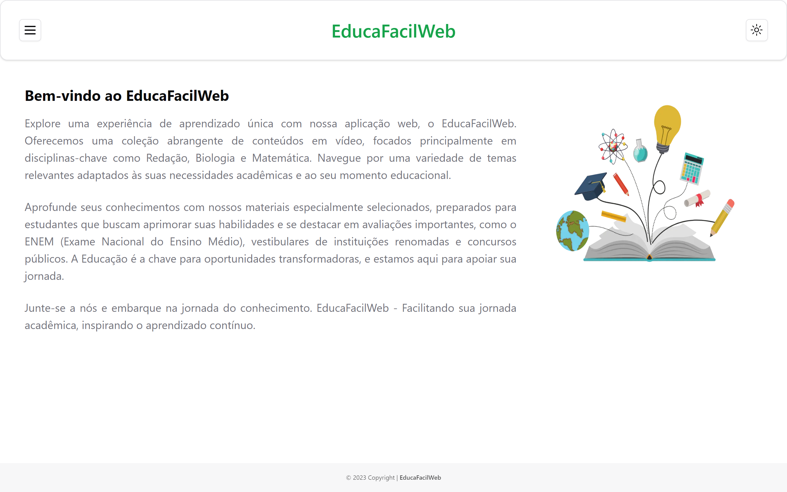

# EducaFacilWeb



> Um site educacional para apoiar alunos em seus estudos. Desfrute de vídeos de diferentes disciplinas e melhore seu desempenho acadêmico.

## 🔧 Tecnologias utilizadas

- React
- Next.js
- Tailwind CSS
- Shadcn UI

## Funcionalidades

- [x] Modo Escuro/Claro
- [x] Videos aulas de disciplinas chaves junto com materiais extras gratuitamente

## 💻 Pré-requisitos

Antes de começar, verifique se você atendeu aos seguintes requisitos:

- Você tem uma máquina `<Windows / Linux / Mac>`.
- Você tem o Node.js instalado em sua máquina.

## 🚀 Instalando EducaFacilWeb

Para instalar o EducaFacilWeb, siga estas etapas:

```bash
# clone o repositório
$ git clone git@github.com:eupedrohenrique/educafacilweb.git
```

## ☕ Usando EducaFacilWeb

Para usar EducaFAcilWeb, siga estas etapas:

```bash
# Entre na pasta do projeto
$ cd educafacilweb

# Instale as dependências
$ npm install

# Execute o projeto
$ npm run dev
```

- O projeto estará sendo executado em http://localhost:3000.

## 📫 Contribuindo para EducaFacilWeb

Para contribuir com EducaFacilWeb, siga estas etapas:

1. Bifurque este repositório.
2. Crie um branch: `git checkout -b <nome_branch>`.
3. Faça suas alterações e confirme-as: `git commit -m '<mensagem_commit>'`
4. Envie para o branch original: `git push origin <nome_do_projeto> / <local>`
5. Crie a solicitação de pull.

Como alternativa, consulte a documentação do GitHub em [como criar uma solicitação pull](https://help.github.com/en/github/collaborating-with-issues-and-pull-requests/creating-a-pull-request).

## 😄 Seja um dos contribuidores

Quer fazer parte desse projeto? Clique [AQUI](CONTRIBUTING.md) e leia como contribuir.

## 🎯 Status do projeto

O projeto está concluído.

## 📝 Licença

Esse projeto está sob licença. Veja o arquivo [LICENÇA](LICENSE.md) para mais detalhes.
